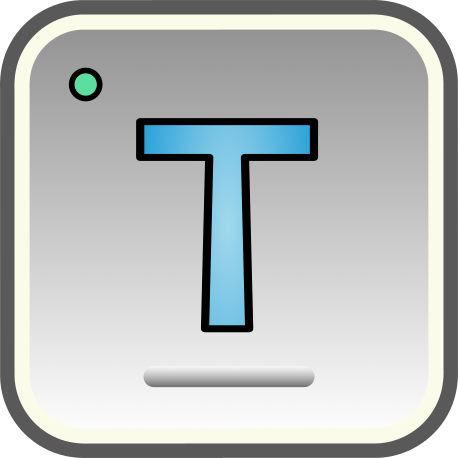
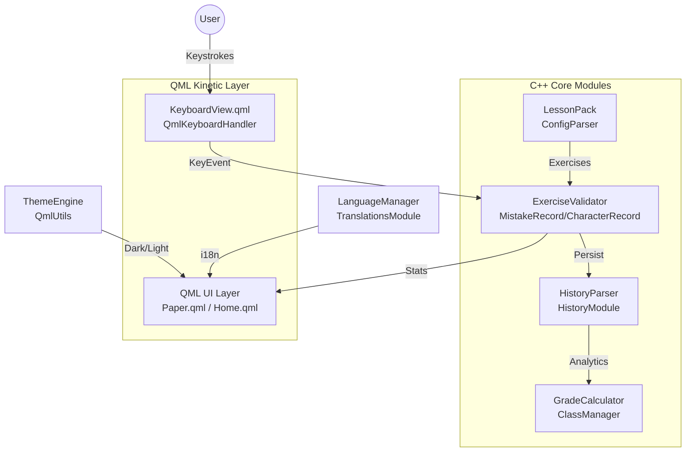

# ⌨️ Open-Typer — The Engineered Typing Tutor

[](https://github.com/rahulcvwebsitehosting/Open-Typer/actions/workflows/linux-build.yml)
[](https://github.com/rahulcvwebsitehosting/Open-Typer/actions/workflows/macos-build.yml)
[](https://github.com/rahulcvwebsitehosting/Open-Typer/actions/workflows/windows-build.yml)
[](https://github.com/rahulcvwebsitehosting/Open-Typer/actions/workflows/wasm-build.yml)
[](https://github.com/rahulcvwebsitehosting/Open-Typer/actions/workflows/snap.yml)

[](https://isocpp.org/)
[](https://www.qt.io/)
[](https://doc.qt.io/qt-6/qml-applications.html)
[](LICENSE)
[](https://github.com/rahulcvwebsitehosting/Open-Typer)

> **"I don't just build websites — I engineer muscle memory."**
> A premium, production-grade typing tutor that treats touch-typing like structural engineering — precise, measurable, and repeatable. Re-engineered by **Rahul Shyam** from Civil Engineering logic to Full-Stack performance.

<a name="readme-top"></a>

<p align="center">
  <a href="https://github.com/rahulcvwebsitehosting/Open-Typer">
    
  </a>
  <h3 align="center">Open-Typer</h3>
  <p align="center">
    Free and open source • Cross-platform • Offline-first<br/>
    <a href="https://rahulshyam-portfolio.vercel.app/"><strong>Portfolio »</strong></a> •
    <a href="https://github.com/rahulcvwebsitehosting/Open-Typer/issues">Report Bug</a> •
    <a href="https://github.com/rahulcvwebsitehosting/Open-Typer/issues">Request Feature</a>
  </p>
</p>

<details>
  <summary>Table of Contents</summary>
  <ol>
    <li><a href="#-problem-vs-solution">Problem vs. Solution</a></li>
    <li><a href="#-intelligence--architecture">Intelligence & Architecture</a></li>
    <li><a href="#-highlights">Highlights</a></li>
    <li><a href="#-technical-specifications">Technical Specifications</a></li>
    <li><a href="#-screenshots">Screenshots</a></li>
    <li><a href="#-getting-started">Getting Started</a></li>
    <li><a href="#-project-structure">Project Structure</a></li>
    <li><a href="#-roadmap">Roadmap</a></li>
    <li><a href="#-contributing">Contributing</a></li>
    <li><a href="#-license">License</a></li>
    <li><a href="#-connect">Connect</a></li>
  </ol>
</details>

---

## 🎯 Problem vs. Solution

| The Challenge | The Open-Typer Solution |
| :--- | :--- |
| **Static drills** with no progression | **Packs & Lessons Engine:** Touch → Word → Sentence → Text progression, auto-generated + custom text files |
| **One layout fits all** | **Multi-Keyboard Intelligence:** Real-time layout switching via `libxkbcommon` + `xkeyboard-config`, visual `KeyboardView.qml` |
| **Opaque feedback** | **Advanced Validation:** Per-character `ExerciseValidator`, `MistakeRecord`/`CharacterRecord`, error-word regeneration & reverse-text modes |
| **No long-term insight** | **History & Grading:** `HistoryParser` with persistent exercise history, `GradeCalculator`/`ClassManager`, timed exercises & typing tests |
| **Bulky, inconsistent installs** | **Native Everywhere:** Qt 5/6, QML Material, AppImage · Snap · PPA · DMG · MSI · WASM — one codebase |

## 🧠 Intelligence & Architecture

Inspired by my other work — **TypeArena** (real-time typing arena with Gemini AI), **EduBeam** (browser FEM) and **myportfolio** (AI-native blueprint) — Open-Typer is engineered as a **modular, offline-first desktop system** with a QML kinetic layer over a C++ core.

### System Flow: Typing Telemetry Loop



### Component Blueprint

| Component | Responsibility | Technical Implementation |
| :--- | :--- | :--- |
| **KeyboardView / KeyboardKey** | Visual layout, highlight next key | QML + `KeyboardUtils.cpp` + `Key`/`KeyboardLayout` models |
| **ExerciseValidator** | Real-time correctness, WPM/accuracy | C++ `CharacterRecord` every 500ms, confusion analysis |
| **LessonPack / ConfigParser** | Load packs, parse lessons | `IConfigParser`, `BuiltinPacks`, custom text import |
| **History / Export** | Persist & export results | `HistoryParser`, `ExportProvider`/`ExportTable`, Print support |
| **ThemeEngine / UiEngine** | Dark/Light, Material style | `QmlUtils`, `UiEngine::setTheme()`, `QQuickStyle::Material` |
| **Updater** | Cross-platform updates | `WindowsUpdater` / `StubUpdater`, AppImage zsync |

---

## ✨ Highlights

- 📦 **Packs with lessons** — touch, word, sentence, text exercises; pack editor (QML) for custom packs
- ⌨️ **Any layout** — QWERTY, AZERTY, Colemak & more via native XKB, live preview
- 📄 **Custom exercises** — import `.txt`, timed mode, reverse-text & error-words regeneration
- 🌐 **Multilingual** — `sk_SK`, `de_DE`, `ru_RU`, `uk_UA` + growing, `LanguageManager`
- 🎨 **Customization** — font, colors, Material dark/light, responsive `Paper.qml`
- 📊 **Telemetry** — built-in exercise history, `ExerciseSummary.qml`, grading per class
- 🖨️ **Export & Print** — `ExportDialog`, `ExportTable`, QML `Print`
- 🔒 **Offline-first** — no telemetry leaves device; models stay local (like EduBeam)

### ⏱ NEW 5.3.2 — Para Time Attack (typing.com × LiveChat × Typewizz)

> **Like para with time limit + WPM/error** — deep-analyzed from `typing.com/student/tests` (1/3/5 min + Page), `livechat.com/typing-speed-test` (60s, WPM=corrected CPM/5, 1000 common words), `typewizz.com/typing-test` (1 min, Bronze 200 CPM 96.5% / Silver 250 98.5% / Gold 350 99.5%).

- **File → Para Time Attack...** / **Test → Quick 60s**: dialog with `Time: 15s/30s/60s/2m30s/3m/5m/10m/Custom`, `Source: Random Words (1000 common) / Paragraph Prose (Typewizz continuous) / Current Exercise / Custom File`, `Length: Short 150 / Medium 300 / Long 600 / Full Page` (no timer, typing.com Page)
- **Live HUD:** `WPM (net)` + `CPM (net/gross)` + `Accuracy` + `Time remaining` + `Progress bar` (red <10s) + `Gold/Silver/Bronze` preview — LiveChat dual CPM + Typewizz cert live
- **Paragraph engine:** `generate_random_para(300, "words")` (LiveChat 1000 words) or `Paragraph Prose` (concatenated `res/packs` Text sublessons, Typewizz style) or `Current Exercise` repeated, wrapped at 60 via `ConfigParser::initExercise`
- **End card:** `WPM/CPM gross/net`, `Accuracy`, `Errors`, `Error words`, `Certificate` (Gold 350 99.5% top 8% / Silver 250 98.5% top 21% / Bronze 200 96.5% top 39%) + `Retry / Next Para / View Error Words` — Typewizz cert + LiveChat global scores (Supabase-ready)
- **Formulas:** `CPM = correct/min`, `WPM = CPM/5` (de-facto LiveChat), `Accuracy = correct/typed` — Gross vs Net shown, timeout or completion triggers certificate — `python/open_typer.py:113` `wpm_calc/cpm_calc/cert_for`

## 🛠️ Technical Specifications

| Layer | Choice | Why |
| :--- | :--- | :--- |
| **Framework** | Qt 5.15 / Qt 6 + QML | Native performance, one codebase for 4 platforms |
| **Language** | C++17 + QML + JS | Type-safe core, declarative kinetic UI |
| **Build** | qmake (`Open-Typer.pro`, `app.pro`) · CMake flagged | `build.sh` → `open-typer.sh` |
| **Styling** | `res/styles/light|dark/style.qss` (qtsass) + Material | Consistent, themeable |
| **i18n** | `translations/Open-Typer_*.ts` | Linguist-based |
| **Packaging** | AppImage (linuxdeploy), Snap, Debian PPA, NSIS (Win), DMG (macOS), WASM | `snap/snapcraft.yaml`, `debian/*`, `.github/workflows/*` |
| **Testing** | `clang-format` enforced, `lint.yml` | Style-gated PRs |
| **License** | GPL-3.0 | See [LICENSE](LICENSE) — original attribution preserved in git history |

---

## 🖼️ Screenshots

[![Open-Typer Light][product-screenshot]](https://rahulshyam-portfolio.vercel.app/)

*Light — `docs-data/res/images/main_window_light.png` · Dark — `main_window_dark.png` · Appearance — `appearance_settings.png`*

---

## 🚀 Getting Started

### Prerequisites

- **Qt** 5.15 or 6.x — [qt.io/download](https://www.qt.io/download-qt-installer)
- **C++17** · `g++` / `clang` + `make` · `git`
- Linux deps: `qttools5-dev-tools qtbase5-dev qtdeclarative5-dev qtquickcontrols2-5-dev libqt5charts5-dev libssl-dev` (see `debian/control`)

### Building

```bash
git clone https://github.com/rahulcvwebsitehosting/Open-Typer.git
cd Open-Typer
# via script (Linux/macOS)
./build.sh
# or manually
qmake && make -j$(nproc)
./open-typer.sh
```

Full matrix — see [Build Instructions](https://open-typer.github.io/docs/md_docs_data_pages_Build_instructions.html) (mirrored at `docs-data/`). WebAssembly via `wasm-build.yml`.

### Installation

**Windows / macOS**
Download latest release from [GitHub Releases](https://github.com/rahulcvwebsitehosting/Open-Typer/releases/latest) or [SourceForge](https://sourceforge.net/projects/open-typer/). *Binaries unsigned — “Run anyway” / “Open” via right-click.*

**Any Linux — AppImage**
```bash
wget https://github.com/rahulcvwebsitehosting/Open-Typer/releases/latest/download/Open-Typer-x86_64.AppImage
chmod +x Open-Typer-x86_64.AppImage
./Open-Typer-x86_64.AppImage
```
Also: `sudo snap install open-typer`

**Ubuntu PPA** (maintained as `ppa:rahulshyam/open-typer`)
```bash
sudo add-apt-repository ppa:rahulshyam/open-typer
sudo apt update
sudo apt install -y open-typer
```

---

## 📁 Project Structure

```text
src/                 C++ core + QML
  app/               App bootstrap, MainWindow.qml, dialogs (About, Settings, TypingTest)
  framework/         global, keyboard, lessonpack, validator, ui, uicomponents, utils, translations, network
  grades/            GradeCalculator, ClassManager
  history/           HistoryParser, ExerciseHistory.qml
  packeditor/        PackEditor.qml / PackEditorModel
  updater/           WindowsUpdater / StubUpdater
res/                 Icons, images, linux-release, styles (qss)
translations/        Linguist .ts (sk, de, ru, uk)
docs-data/           Doxygen pages, theme (doxygen-awesome)
snap/                snapcraft.yaml
debian/              control, copyright
.github/workflows/   linux/macos/windows/wasm/snap/release/lint
```

## 🗺️ Roadmap

See the [open issues](https://github.com/rahulcvwebsitehosting/Open-Typer/issues) for proposed features & known issues — parity with my other typed ecosystems like **TypeArena** (multiplayer + Gemini coaching) is on the horizon: live race mode, AI diagnostics for confusion pairs, and cloud-synced XP.

<p align="right">(<a href="#readme-top">back to top</a>)</p>

## 🤝 Contributing

Contributions make open source amazing. Any **greatly appreciated** contribution — star first, then:

1. Fork (`git checkout -b feat/Amazing`)
2. Commit (`git commit -m 'feat: Amazing'`) — `clang-format -i src/*.cpp` required
3. Push (`git push origin feat/Amazing`)
4. Open PR

Linter gate: `.github/workflows/lint.yml` runs `cpp-linter`.

<p align="right">(<a href="#readme-top">back to top</a>)</p>

## 📄 License

Distributed under **GNU General Public License v3.0**. See [LICENSE](LICENSE) for full text.
Original project by `Open-Typer` org — re-engineered & maintained by **Rahul Shyam** with full git history preserved.

<p align="right">(<a href="#readme-top">back to top</a>)</p>

## 🌐 Connect — Designed & Engineered by Rahul Shyam

> *Civil Engineer (Chennai, B.E. Civil ESEC) → Full-Stack / AI Engineer — I engineer systems from site to cloud. Chennai Underground Metro (Tata Projects) / BIM Revit at Pinnacle Future Build → React/Next.js, Gemini, Firebase, Cloud Run, Vercel — same intensity on site and in code.*

[](https://rahulshyam-portfolio.vercel.app/)
[](https://github.com/rahulcvwebsitehosting)
[](https://www.linkedin.com/in/rahulshyamcivil/)
[](https://x.com/RahulShyamCv)
[](https://www.threads.net/@RahulCvJPS)
[](https://www.instagram.com/rahulcvjps/)
[](mailto:rahulshyamcv@gmail.com)
[](https://wa.me/917305169964)

If this helped your WPM, give it a ⭐ — and check my other builds: **TypeArena** (typing arena), **EduBeam** (beam FEM), **MrBeam**, **FabricScan-AI**, **StudySense**.

---

<div align="center">
  <sub>© 2021-2026 Rahul Shyam. Built with precision and purpose — from blueprint to binary.</sub><br/>
  <sub>Original Open-Typer © 2021-2023 adazem009 — preserved in commit history & LICENSE.</sub>
</div>

<!-- MARKDOWN LINKS & IMAGES -->
[contributors-shield]: https://img.shields.io/github/contributors/rahulcvwebsitehosting/Open-Typer.svg?style=for-the-badge
[contributors-url]: https://github.com/rahulcvwebsitehosting/Open-Typer/graphs/contributors
[forks-shield]: https://img.shields.io/github/forks/rahulcvwebsitehosting/Open-Typer.svg?style=for-the-badge
[forks-url]: https://github.com/rahulcvwebsitehosting/Open-Typer/network/members
[stars-shield]: https://img.shields.io/github/stars/rahulcvwebsitehosting/Open-Typer.svg?style=for-the-badge
[stars-url]: https://github.com/rahulcvwebsitehosting/Open-Typer/stargazers
[issues-shield]: https://img.shields.io/github/issues/rahulcvwebsitehosting/Open-Typer.svg?style=for-the-badge
[issues-url]: https://github.com/rahulcvwebsitehosting/Open-Typer/issues
[license-shield]: https://img.shields.io/github/license/rahulcvwebsitehosting/Open-Typer.svg?style=for-the-badge
[license-url]: https://github.com/rahulcvwebsitehosting/Open-Typer/blob/master/LICENSE
[product-screenshot]: docs-data/res/images/main_window_light.png
